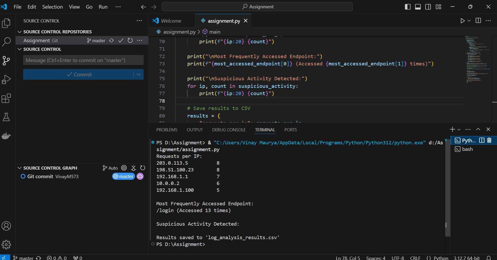

This submission provides a Python-based log analysis tool aimed at web server administrators. It parses server logs to count requests per IP, identifies the most accessed endpoints, and detects suspicious activities like failed login attempts. Results are displayed in the terminal and saved in a CSV file for further analysis. The package includes the Python script, a sample log file.

